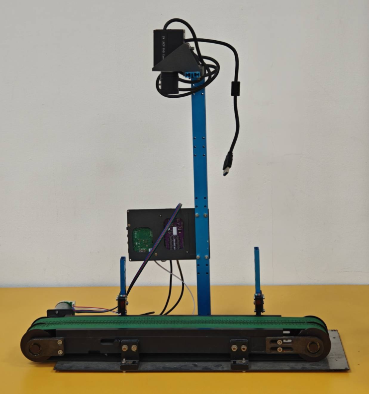
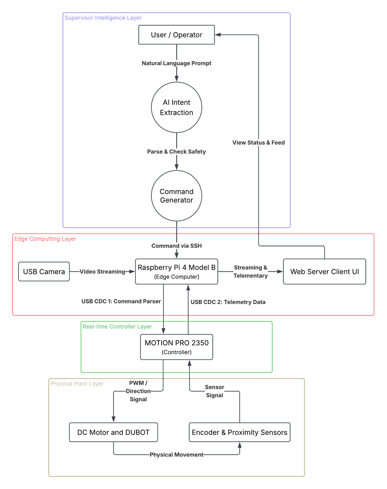

# PAML
A Prompt as Machine Language (PAML) industry machine framework integrating LLM supervisory intelligence with RP2350 real-time control for Society 5.0 manufacturing.

# Overview

PAML enables manufacturing workflows to be configured and supervised using natural-language prompts. The LLM interprets operator instructions and converts them into validated machine workflows, while the Raspberry Pi manages workflow execution, vision processing, inspection, data logging, and operator feedback.

The RP2350 provides deterministic real-time control of the conveyor, sensors, motor, encoder, camera triggering, and lighting. This architecture separates flexible AI reasoning from reliable low-level machine control, enabling safer and more adaptable human–machine interaction.

# System Architecture

PAML consists of four layers:
* Supervisor Intelligence: Interprets natural-language prompts and generates validated machine commands.
* Edge Computing: Raspberry Pi 4 manages workflows, vision processing, communication, and operator feedback.
* Real-time Control: MOTION PRO 2350 handles deterministic motor and sensor control.
* Physical Plant: Includes the conveyor motor, encoder, proximity sensors, and DOBOT MG400.

# DUBOT

# Device's Data Sheet
* [CYTRON MOTION 2350 Pro](https://github.com/CytronTechnologies/Cytron-MOTION-2350-PRO)
* [Pi Interface v2.0]
* [Raspberry Pi 4 Model B](https://www.raspberrypi.com/products/raspberry-pi-4-model-b/specifications/)
* [DC Gear Motor: JGB37-3530-CE DC24V1600RPM](https://precisionminidrives.com/product/12v24v-dc-37mm-diameter-small-electric-gear-motors-nfp-37-3530?srsltid=AfmBOoqLyXzGaCBg0TPZlXQf65OMGXQbGKlJaB8XlSD6n5TNAqdIhCrDr2w)
* [Quadrature Encoder: 448CPR](https://precisionminidrives.com/product/37mm-dc-motor-with-photoelectric-encoder-55mm-type-model-nfp-gm37-520-pen?utm_source=chatgpt.com)
* [2x NPN Reflector Proximity Sensors: Keyence PZ2-42](https://www.keyence.co.th/products/sensor/photoelectric/pz2/models/pz2-42/?utm_source=chatgpt.com)
* [USB Camera: ZW LRCP FHD Camera]
* [DOBOT MG400](https://www.dobot-robots.com/products/desktop-four-axis/mg400.html?lang=en%3Faid%3D263%3Faid%3D262%3Faid%3D262%3Faid%3D262%3Faid%3D262%3Faid%3D262%3Faid%3D262%3Faid%3D263%3Faid%3D263%3Faid%3D263%3Faid%3D263&utm_source=chatgpt.com)

# Wiring
